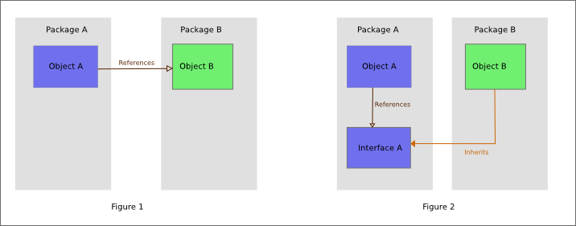
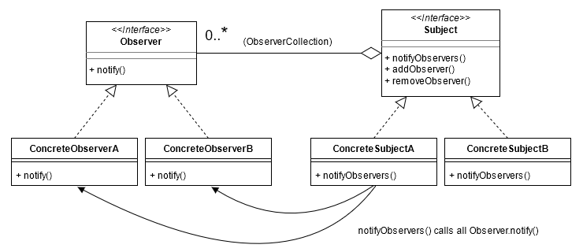

# 设计模式

## 什么是设计模式？

> 在软件工程中，设计模式（design pattern）是对软件设计中普遍存在（反复出现）的各种问题，所提出的解决方案。

长期以来，设计模式指的是《设计模式：可复用面向对象软件的基础》一书中总结的 23 种面向对象的设计模式。

> 面向对象设计模式通常以 class 或 object 来描述其中的关系和相互作用。

## 什么是面向对象？

> 面向对象程序设计（英语：Object-oriented programming，缩写：OOP）是种具有对象概念的编程典范，同时也是一种程序开发的抽象方针。它可能包含数据、特性、代码与方法。对象则指的是类的实例。它将对象作为程序的基本单元，将程序和数据封装其中，以提高软件的重用性、灵活性和扩展性，对象里的程序可以访问及经常修改对象相关连的数据。

- JavaScript有基础类型和对象类型，无类型系统，所以严格意义上说 JavaScript**不是面向对象**的。但由于有对象（object）的存在，JavaScript 的开发者依旧可以借鉴设计模式写出更好的代码。
- TypeScript有完整且强大的类型系统，所以是面向对象的。

## SOLID (面向对象设计的基本原则)

| 首字母 | 指代         | 概念                                                 |
| ------ | ------------ | ---------------------------------------------------- |
| S      | 单一功能原则 | 每个类仅具有一种单一功能                             |
| O      | 开闭原则     | 软件应该对于扩展开放，但对于修改封闭                 |
| L      | 里氏替换原则 | 派生类（子类）对象可以在程序中代替其基类（超类）对象 |
| I      | 接口隔离原则 | 多个特定接口要好于一个宽泛用途的接口                 |
| D      | 依赖反转原则 | 方法依赖于抽象而不是一个实例                         |

### 单一功能原则

### 开闭原则

- 在**只新增代码，不修改原代码**的情况下增加新的功能
- **面向接口编程**是个好主意

``` TypeScript
// 我会飞
interface ICanFly {
    void fly(); // 必须具有fly方法，这是约定...
}

// 鸟类
class Bird implements ICanFly {
    fly() {
        // 小鸟在用力拍翅膀...
    }
}

// 飞机
class Plane implements ICanFly {
    fly() {
        // 飞机的发动机在喷气...
    }
}

// 起飞
function takeOff(sth: ICanFly) {
    // 飞飞飞
    sth.fly() // sth一定按约定实现了fly方法...
}

// 那么，如何在不改变上述代码的情况下让takeOff支持宇宙飞船？

// 很简单，只需要让新建Space类，让它实现ICanFly接口即可
class Space implements ICanFly {
    fly() {
        // 飞船的核反应堆在闪闪发光...
    }
}
```

### 里氏替换原则

> 子类继承父类时，除添加新的方法完成新增功能外，尽量不要重写父类的方法

- 如果两个类无法实现里氏替换规则，重新思考是否使用继承

### 接口隔离原则

- 接口要尽可能的拆分，避免胖接口

```TypeScript
// 胖接口
interface IBird {
    void fly();

    void eat();
}

// 拆分
interface ICanFly {
    void fly();
}

interface IAlive {
    void eat();
}
```

### 依赖反转原则

- 高层类定义好接口，自身的实现依赖于定义的接口；同时底层类的实现也依赖高层类的接口。
- 由于这种设计，高层类可以使用任何实现了接口的底层类，这样就可以实现**依赖注入**。



### 依赖注入 <a href="/detail/designPatterns%2Fioc" target="_blank" >示例代码</a>

> 依赖注入形式下，调用方不再直接使用**依赖**，取而代之是**注入** 。**注入**是指将**依赖**传递给调用方的过程。在**注入**之后，调用方才会调用该**依赖**。

- 依赖注入带来的额外好处是**将类实例化的过程解耦**
  
## 23 种设计模式


## 创建型模式

> 创建型模式提供了创建对象的机制， 能够提升已有代码的灵活性和可复用性。

> 创建型设计模式主要解决“对象的创建”问题。

在创建复杂对象时，使用创建型模式可以避免创建对象和对象的消费过程耦合，同时提高代码复用率。

### Vue中的创建型模式

在使用templat方式声明组件时，通过标签引用子组件，相当于直接组合具体类，这种写法缺少动态能力，我们可以使用动态组件技术修改部分子组件的运行时实例，但却无法修改子组件的布局方式。所以要想更好的利用创建型模式，需要使用渲染函数render或者JSX语法。

``` javascript
render: function (createElement) {
  return createElement(MyComponent, {
    props: {
      someProp: 'foobar'
    }
  })
}
```

### 工厂方法 <a href="/detail/designPatterns%2Ffactory" target="_blank" >示例代码</a>

#### 定义和描述

> 工厂对象通常包含一个或多个方法，用来创建这个工厂所能创建的各种类型的对象。这些方法可能接收参数，用来指定对象创建的方式，最后返回创建的对象。

- 对象的使用者把对象的创建过程委托给**工厂**，在编程时只依赖工厂接口，至于最终如何实例化对象，取决于使用的具体工厂和构建时传参。

#### 真实世界类比

小明去商店买饮料，小明可以买到可乐，雪碧等等许多饮料。小明想：小卖部真方便呀，我不用跑到可乐工厂去买可乐，也不用跑到雪碧工厂买雪碧。这里的小卖部既可以**提供**可乐也可以**提供**雪碧，作为**消费者**的小明只需要**依赖**小卖部这个饮料**供应商**就好了。这个例子中，小卖部就是可乐工厂和雪碧工厂的抽象，饮料就是可乐和雪碧的抽象。

#### 类图


#### 应用场景

- 当我们用不同的参数生成不同的对象，我们就是在使用**简单工厂**
- 考虑较复杂的一个场景，我们希望统一整个项目的对话框。对话框目前有两种：信息对话框和表单对话框。信息对话框只要展示提示信息，表单对话框展示表单组件。这时可以考虑工厂方法。

``` TypeScript
interface VueComponent {}

enum MessageDialogType {
  Warning,
  Error,
  Success,
}

interface IFormData {
  [prop: string]: string | number;
}

interface IDialogCreateOptions {
  title: string;
}

interface IFormDialogCreateOptions extends IDialogCreateOptions {
  formComponent: VueComponent;
  formData: IFormData;
}

interface IMessageDialogCreateOptions extends IDialogCreateOptions {
  message: string;
  type: MessageDialogType;
}

interface IDialogFactory {
  createDialog(options: IDialogCreateOptions);
}

class FormDialogFactory implements IDialogFactory {
  createElement: Function;
  constructor(createElement: Function) {
    this.createElement = createElement;
  }

  createDialog(options: IFormDialogCreateOptions) {
    return this.createElement("div", {
      props: {
        formData: options.formData,
      },
    });
  }
}

class MessageDialogFactory implements IDialogFactory {
  createElement: Function;
  constructor(createElement: Function) {
    this.createElement = createElement;
  }

  createDialog(options: IMessageDialogCreateOptions) {
    return this.createElement("div", {
      props: {
        message: options.message,
      },
    });
  }
}

// 父组件如何使用Dialog工厂
function render(createElement) {
  // 创建提示对话框
  const messageDialogFactory = new MessageDialogFactory(createElement);
  messageDialogFactory.createDialog({
    title: "温馨提示",
    type: MessageDialogType.Warning,
    message: "您没有权限！",
  });

  // 创建表单对话框
  const formComponent: VueComponent = {}; // 表单组件
  const formDialogFactory = new FormDialogFactory(createElement);
  formDialogFactory.createDialog({
    title: "编辑用户信息",
    formComponent,
    formData: {
      username: "",
      age: 18,
    },
  });
}
```

### 抽象工厂 <a href="/detail/designPatterns%2FabstractFactory" target="_blank" >示例代码</a>

#### 定义和描述

> “工厂”是创建产品（对象）的地方，其目的是将产品的创建与产品的使用分离。抽象工厂模式的目的，是将若干抽象产品的接口与不同主题产品的具体实现分离开。这样就能在增加新的具体工厂的时候，不用修改引用抽象工厂的客户端代码。

#### 真实世界类比

小明在考驾照时学会了方向盘，刹车，转向灯的使用方式。拿到驾照后小明要买车了，他去车厂试驾，发现所有品牌的车都有方向盘，刹车和转向灯，而且**功能**都是一样的，只是装饰**风格**不同。因为车管所**规定**，任何车厂生产的汽车都必须具有方向盘，刹车，转向灯。这里车管所就是**抽象工厂**，它规定了车具有哪些功能，各个汽车厂商就是**具体工厂**，负责实际的生产。所以对小明来说，任何车都是一样的开。

#### 类图


#### 应用场景

现在要用8套设计和交互规范实现切换皮肤功能，某些可以通过修改CSS直接实现，但有些组件交互逻辑完全不同。此时可以用抽象工厂模式。

### 建造模式 <a href="/detail/designPatterns%2Fbuilder" target="_blank" >示例代码</a>

#### 定义和描述

> 建造模式可以将复杂对象的建造过程抽象出来（抽象类），使这个抽象过程的不同实现方法可以构造出不同表现（属性）的对象。

#### 真实世界类比

小明打算DIY一台电脑但是钱不够，于是他先买了主板，然后从**几套配置**中选了一套攒配件慢装。小明发现cpu，内存条，显卡可以用任何顺序安装，于是每个月买一个配件，买一个就装到主板上。几个月后攒齐配件，一次点亮。几年后电脑的配置慢慢提高了，小明想提升下散热能力，发现只要**加装**水冷系统就好。这个例子中电脑主板就是**建造者**，提供配件接入能力，小明作为**主管**拥有**多套建造方案**，也决定着每套方案中配件的**接入顺序**。

#### 类图


#### 应用场景

前端调用接口时往往要构造一个巨大的参数对象，其中有些部分是所有/某些接口公用的，比如用户信息和系统信息。通常参数构造逻辑不是和业务逻辑**藕合**，就是和HTTP客户端逻辑（比如Axios）**耦合**，这时我们可以使用建造模式将其分离。

### 抽象工厂和建造模式的比较

- Factory的methods之间通常没有关联；Builder的methods可能同属于某个产品的构建过程。
- 建造模式多了Director角色，令其控制组装过程；抽象工厂的产品往往在客户端被组装。

### 原型模式 <a href="/detail/designPatterns%2Fprototype" target="_blank" >示例代码</a>

#### 定义和描述

> 特点在于通过“复制”一个已经存在的实例来返回新的实例,而不是新建实例。被复制的实例就是我们所称的“原型”，这个原型是可定制的。

#### 真实世界类比

原型模式已经深深根植于JavaScript语言之中，前端日常开发无时无刻不在使用原型模式，几乎所有对象都是从Object对象复制而来。

#### 类图


### 单例模式 <a href="/detail/designPatterns%2Fsingleton" target="_blank" >示例代码</a>

#### 定义和描述

> 在应用这个模式时，单例对象的类必须保证只有一个实例存在。

#### 真实世界类比

小明的大学老师习惯在课前点名，每次使用“小明”这个称呼并不会创建一个新的引用对象，所有的指称都指向小明这个已经存在的人。

#### 能否直接使用全局变量保存单例？

- 当然可以，不过全局变量存在很多问题，它很容易造成命名空间污染
- 使用闭包防止变量泄漏
- 使用命名空间防止冲突

#### 应用场景

- 使用Vuex每个应用将**仅仅包含一个store实例**
- 全局性的dom只保留一个实例，比如全局dialog

``` javascript
var myApp = {} // 使用命名空间

myApp.createLoginLayer = (function () {
  var div;
  return function () {
    if (!div) {
      div = document.createElement("div");
      div.innerHTML = "我是登录浮窗";
      div.style.display = "none";
      document.body.appendChild(div);
    }
    return div;
  };
})();
```

- 如果某些接口只被调用一次（比如用户信息、菜单、配置项），可以结合Promise封装一些惰性且带缓存的接口
  
``` TypeScript
namespace DisposableApis {
  let permissions: [] | null = null;
  export async function getPermissions() {
    if (!permissions) {
      const res = await fetch('https://***.com/user', {
        credentials: "include",
      })
      permissions = await res.json();
      return permissions
    } else {
      return Promise.resolve(permissions);
    }
  };
}

function getUserInfo() {
  DisposableApis.getPermissions().then(
    userInfo => {
      console.log('userInfo', userInfo)
    }
  )
}

getUserInfo()

setTimeout(
  getUserInfo, 1000
)
setTimeout(
  getUserInfo, 2000
)
setTimeout(
  getUserInfo, 3000
)
```

## 结构型模式

> 结构型模式介绍如何将对象和类组装成较大的结构， 并同时保持结构的灵活和高效。

> 结构型模式主要总结了一些类或对象组合在一起的经典结构，这些经典的结构可以解决特定应用场景的问题。

### 适配器模式 <a href="/detail/designPatterns%2Fadapter" target="_blank" >示例代码</a>

#### 定义和描述

> 有时候也称包装样式或者包装。将一个类的接口转接成用户所期待的。一个适配使得因接口不兼容而不能在一起工作的类能在一起工作，做法是将类自己的接口包裹在一个已存在的类中。


- Vue中的filter语法糖，el-table中的filter参数，都应用了适配器模式。

- 开发过程中我们经常使用适配器模式，只不过没有把它分离成单独的adapter。

``` javascript
// 计算总年龄
function getTotalAge(persons) {
  let age = 0;
  persons.forEach((person) => {
    age += person.age;
  });
  return age;
}

const persons = [
  {
    name: "小明",
    age: 18,
  },
  {
    name: "小李",
    age: 19,
  },
];

// 旧调用方式
const age1 = getTotalAge(persons);
console.log("age1", age1);

// 能否兼容新的数据结构？
const buildings = [
  {
    name: "教学楼",
    year: "12",
  },
  {
    name: "食堂",
    year: "8",
  },
];

// 常规写法
const age2 = getTotalAge(
  buildings.map((item) => {
    return {
      age: Number(item.year),
    };
  })
);
console.log("age2", age2);

// 优化：分离出adapter
function adapter(building) {
  return {
    age: Number(building.year),
  };
}
const age3 = getTotalAge(buildings.map(adapter));
console.log("age3", age3);
```

### 桥接模式 <a href="/detail/designPatterns%2Fbridge" target="_blank" >示例代码</a>

> 桥接模式是软件设计模式中最复杂的模式之一，它把事物对象和其具体行为、具体特征分离开来，使它们可以各自独立的变化。
> 桥接模式就是为了避免直接继承带来的子类爆炸。

- 由于JavaScript中不存在类型，当然也不需要桥接模式。


### 组合模式 <a href="/detail/designPatterns%2Fcomposite" target="_blank" >示例代码</a>

> The intent of a composite is to "compose" objects into tree structures to represent part-whole hierarchies.
> 组合模式通过把对象“组装”在树状结构之中来表示部分-整体结构

- 让组合对象和单个对象看起来一样（使用同样的接口调用）


#### 应用场景

存在部分-整体结构的地方都可能用到组合模式：

- 前端组件化就是应用了组合模式思想，父组件包含子组件，父组件渲染时会在内部渲染所有子组件。
- 表单校验功能，客户端只需执行表单的校验方法，该方法内部遍历校验所有表单项。
- 设计一个无层数限制，折叠展示的树状组件，父组件的toggle方法只需调用子组件的toggle，最终在叶子节点实现真正的toggle逻辑。

### 装饰模式 <a href="/detail/designPatterns%2Fdecorator" target="_blank" >示例代码</a>

> 装饰模式，一种动态地往一个类别中添加新的行为的设计模式

- JavaScript装饰器提案正处于草案阶段


### 外观模式 <a href="/detail/designPatterns%2Ffacade" target="_blank" >示例代码</a>

> 外观模为为子系统中的一组界面提供一个统一的高层界面，使得子系统更容易使用。

#### 真实世界类比

小明决定使用中通快递来邮寄一本书，整个邮寄过程需要快递公司各个子系统的协作才能完成，小明不可能和所有子系统交互，他只需要在官网下单就好了。中通官网就是整个快递公司的**外观**。

- 外观模式


### 享元模式 <a href="/detail/designPatterns%2Fflyweight" target="_blank" >示例代码</a>

> 通常物件中的部分状态(state)能够共享。常见做法是把它们放在数据结构外部，当需要使用时再将它们传递给享元。

#### vuex是否应用了享元模式？

### 代理模式 <a href="/detail/designPatterns%2Fproxy" target="_blank" >示例代码</a>

> a proxy is a wrapper or agent object that is being called by the client to access the real serving object behind the scenes. Use of the proxy can simply be forwarding to the real object, or can provide additional logic.


## 行为型模式

> 行为模式负责对象间的高效沟通和职责委派。

> 行为型设计模式主要解决的就是“类或对象之间的交互”问题。

### 责任链模式 <a href="/detail/designPatterns%2FchainOfResponsibility" target="_blank" >示例代码</a>

> 责任链包含了一些命令对象和一系列的处理对象。每一个处理对象决定它能处理哪些命令对象，它也知道如何将它不能处理的命令对象传递给该链中的下一个处理对象。该模式还描述了往该处理链的末尾添加新的处理对象的方法。


### 命令模式 <a href="/detail/designPatterns%2Fcommand" target="_blank" >示例代码</a>

> the command pattern is a behavioral design pattern in which an object is used to encapsulate all information needed to perform an action or trigger an event at a later time.

### 解释器模式

> 指定如何对某种语言中的表达式求值

### 迭代器模式 <a href="/detail/designPatterns%2Fiterator" target="_blank" >示例代码</a>

> 可以让用户透过特定的接口轮流访问容器中的每一个元素而不用了解底层的实现

- javascript迭代器与生成器

### 中介者模式 <a href="/detail/designPatterns%2Fmediator" target="_blank" >示例代码</a>

> 中介者模式定义了一个中介者对象，该对象封装了系统中对象间的交互方式。 由于它可以在运行时改变程序的行为

### 备忘录模式 <a href="/detail/designPatterns%2Fmemento" target="_blank" >示例代码</a>

> The memento pattern is a software design pattern that provides the ability to restore an object to its previous state.

- 备忘录模式是一种用空间换时间的常用手段

### 观察者模式 <a href="/detail/designPatterns%2Fobserver" target="_blank" >示例代码</a>

> 在此种模式中，一个目标对象管理所有相依于它的观察者对象，并且在它本身的状态改变时主动发出通知。这通常透过呼叫各观察者所提供的方法来实现。



- 发布订阅模式通过新增事件中心，避免了目标和观察者互相耦合

### 状态机模式 <a href="/detail/designPatterns%2Fstate" target="_blank" >示例代码</a>

> The state pattern is a behavioral software design pattern that allows an object to alter its behavior when its internal state changes.

- 把状态封装在调用对象之中，通过修改对象状态改变方法的行为

### 策略模式 <a href="/detail/designPatterns%2Fstrategy" target="_blank" >示例代码</a>

> the strategy pattern (also known as the policy pattern) is a behavioral software design pattern that enables selecting an algorithm at runtime.

### 模板方法 <a href="/detail/designPatterns%2Ftemplate" target="_blank" >示例代码</a>

> 模板方法是一个定义在父类别的方法，在模板方法中会呼叫多个定义在父类别的其他方法，而这些方法有可能只是抽象方法并没有实作，模板方法仅决定这些抽象方法的执行顺序，这些抽象方法的实作由子类别负责，并且子类别不允许覆写模板方法。

### 访问者模式 <a href="/detail/designPatterns%2Fvisitor" target="_blank" >示例代码</a>

> 首先我们拥有一个由许多对象构成的对象结构，这些对象的类都拥有一个accept方法用来接受访问者对象；访问者是一个接口，它拥有一个visit方法，这个方法对访问到的对象结构中不同类型的元素作出不同的反应；在对象结构的一次访问过程中，我们遍历整个对象结构，对每一个元素都实施accept方法，在每一个元素的accept方法中回调访问者的visit方法，从而使访问者得以处理对象结构的每一个元素。

- 访问者不需要知道被访问者的结构，由被访问者决定遍历子组件的方式

## 动态语言的设计模式

> 23 种设计模式中的 16 种已经内置在语言之中，或者不复存在

- 动态语言无需想方设法绕开 class 的限制

## 参考资料

本文或多或少引用了以下资料的代码和描述，感兴趣的读者可自行阅读

1. [维基百科](https://zh.wikipedia.org/wiki/%E8%AE%BE%E8%AE%A1%E6%A8%A1%E5%BC%8F%EF%BC%9A%E5%8F%AF%E5%A4%8D%E7%94%A8%E9%9D%A2%E5%90%91%E5%AF%B9%E8%B1%A1%E8%BD%AF%E4%BB%B6%E7%9A%84%E5%9F%BA%E7%A1%80)：权威描述
2. [Typescript演练场](https://www.typescriptlang.org/zh/play)：在线的TypeScript编译执行环境
3. [桥接模式](https://www.liaoxuefeng.com/wiki/1252599548343744/1281319266943009)：廖雪峰老师关于桥接的描述
4. [深入理解设计模式](https://refactoringguru.cn/)：图文并茂
5. 极客时间《设计模式之美》：代码例子比较贴合实际应用场景，收费
