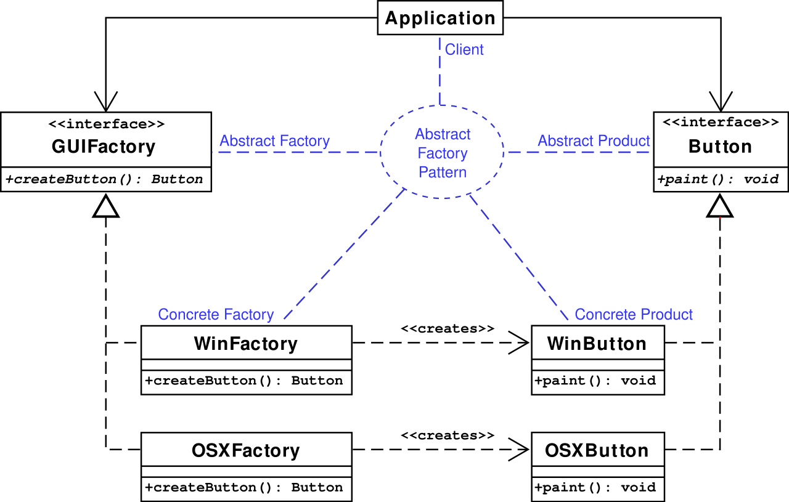

# 设计模式

## 什么是设计模式？

> 在软件工程中，设计模式（design pattern）是对软件设计中普遍存在（反复出现）的各种问题，所提出的解决方案。

长期以来，设计模式指的是《设计模式：可复用面向对象软件的基础》一书中总结的 23 种面向对象的设计模式。

> 面向对象设计模式通常以 class 或 object 来描述其中的关系和相互作用。

## 什么是面向对象？

> 面向对象程序设计（英语：Object-oriented programming，缩写：OOP）是种具有对象概念的编程典范，同时也是一种程序开发的抽象方针。它可能包含数据、特性、代码与方法。对象则指的是类的实例。它将对象作为程序的基本单元，将程序和数据封装其中，以提高软件的重用性、灵活性和扩展性，对象里的程序可以访问及经常修改对象相关连的数据。

- Javascript 对 class 的支持并不完善，所以严格意义上说 Javascript**不是面向对象**的。但由于有对象（object）的存在,Javascript 的开发者依旧可以借鉴设计模式写出更好的代码。
- Typescript 对 class 的支持比较完整，所以是面向对象的。

## SOLID (面向对象设计的基本原则)

| 首字母 | 指代         | 概念                                                 |
| ------ | ------------ | ---------------------------------------------------- |
| S      | 单一功能原则 | 每个类仅具有一种单一功能                             |
| O      | 开闭原则     | 软件应该对于扩展开放，但对于修改封闭                 |
| L      | 里氏替换原则 | 派生类（子类）对象可以在程序中代替其基类（超类）对象 |
| I      | 接口隔离原则 | 多个特定接口要好于一个宽泛用途的接口                 |
| D      | 依赖反转原则 | 方法依赖于抽象而不是一个实例                         |

### 单一功能原则

### 开闭原则

- 在**只新增代码，不修改原代码**的情况下增加新的功能
- **面向接口编程**是个好主意

```typescript
// 我会飞
interface ICanFly {
    void fly(); // 必须具有fly方法，这是约定...
}

// 鸟类
class Bird implements ICanFly {
    fly() {
        // 小鸟在用力拍翅膀...
    }
}

// 飞机
class Plane implements ICanFly {
    fly() {
        // 飞机的发动机在喷气...
    }
}

// 起飞
function takeOff(sth: ICanFly) {
    // 飞飞飞
    sth.fly() // sth一定按约定实现了fly方法...
}

// 那么，如何在不改变上述代码的情况下让takeOff支持宇宙飞船？

// 很简单，只需要让新建Space类，让它实现ICanFly接口即可
class Space implements ICanFly {
    fly() {
        // 飞船的核反应堆在闪闪发光...
    }
}
```

### 里氏替换原则

> 子类继承父类时，除添加新的方法完成新增功能外，尽量不要重写父类的方法

- 如果两个类无法实现里氏替换规则，重新思考是否使用继承

### 接口隔离原则

- 接口要尽可能的拆分，避免胖接口

```typescript
// 胖接口
interface IBird {
    void fly();

    void eat();
}

// 拆分
interface ICanFly {
    void fly();
}

interface IAlive {
    void eat();
}
```

### 依赖反转原则

- 高层类定义好接口，自身的实现依赖于定义的接口；同时底层类的实现也依赖高层类的接口。
- 由于这种设计，高层类可以使用任何实现了接口的底层类，这样就可以实现**依赖注入**。


### 依赖注入

> 依赖注入形式下，调用方不再直接使用**依赖**，取而代之是**注入** 。**注入**是指将**依赖**传递给调用方的过程。在**注入**之后，调用方才会调用该**依赖**。

- 依赖注入带来的额外好处是**将类实例化的过程解耦**
  
<a href="/#/detail/designPatterns%2Fioc" target="_blank" >示例代码</a>

## 23 种设计模式


### 构造器模式

> 构造器模式也叫建造模式，是一种对象构建模式。它可以将复杂对象的建造过程抽象出来（抽象类别），使这个抽象过程的不同实现方法可以构造出不同表现（属性）的对象。

<a href="/#/detail/designPatterns%2Fbuilder" target="_blank" >示例代码</a>

### 工厂方法

> 工厂对象通常包含一个或多个方法，用来创建这个工厂所能创建的各种类型的对象。这些方法可能接收参数，用来指定对象创建的方式，最后返回创建的对象。

- 对象的使用者把对象的创建过程委托给“工厂”，在编程时只依赖工厂接口，至于最终如何实例化对象，取决于使用的具体工厂和构建时传参

- 现代前端日常业务开发过程中往往操作更多的数据，很少操作dom，如果是jQuery时代倒是可以使用UI工厂来创建dom


<a href="/#/detail/designPatterns%2Ffactory" target="_blank" >示例代码</a>

### 抽象工厂

> “工厂”是创建产品（对象）的地方，其目的是将产品的创建与产品的使用分离。抽象工厂模式的目的，是将若干抽象产品的接口与不同主题产品的具体实现分离开。这样就能在增加新的具体工厂的时候，不用修改引用抽象工厂的客户端代码。

- 同工厂方法一样，抽象工厂在前端日常开发中几乎没有用武之地



<a href="/#/detail/designPatterns%2FabstractFactory" target="_blank" >示例代码</a>

### 原型模式

> 特点在于通过“复制”一个已经存在的实例来返回新的实例,而不是新建实例。被复制的实例就是我们所称的“原型”，这个原型是可定制的。

- 原型模式已经深深根植于Javascript语言之中，前端日常开发无时无刻不在使用原型模式，几乎所有对象都是从Object对象复制而来。


<a href="/#/detail/designPatterns%2Fprototype" target="_blank" >示例代码</a>

### 单例模式

> 在应用这个模式时，单例对象的类必须保证只有一个实例存在。

<a href="/#/detail/designPatterns%2Fsingleton" target="_blank" >示例代码</a>

#### 能否直接使用全局变量保存单例？

- 当然可以，不过全局变量存在很多问题，它很容易造成命名空间污染
- 使用闭包防止变量泄漏
- 使用命名空间防止冲突

#### 前端有单例模式的应用场景吗？

- 全局性的dom只保留一个实例，比如全局dialog

``` javascript
var myApp = {} // 使用命名空间

myApp.createLoginLayer = (function () {
  var div;
  return function () {
    if (!div) {
      div = document.createElement("div");
      div.innerHTML = "我是登录浮窗";
      div.style.display = "none";
      document.body.appendChild(div);
    }
    return div;
  };
})();
```

- 如果某些接口只被调用一次（比如用户信息、菜单、配置项），可以结合Promise封装一些惰性且带缓存的接口
  
``` typescript
namespace DisposableApis {
  let permissions: [] | null = null;
  export async function getPermissions() {
    if (!permissions) {
      const res = await fetch('https://***.com/user', {
        credentials: "include",
      })
      permissions = await res.json();
      return permissions
    } else {
      return Promise.resolve(permissions);
    }
  };
}

function getUserInfo() {
  DisposableApis.getPermissions().then(
    userInfo => {
      console.log('userInfo', userInfo)
    }
  )
}

getUserInfo()

setTimeout(
  getUserInfo, 1000
)
setTimeout(
  getUserInfo, 2000
)
setTimeout(
  getUserInfo, 3000
)
```
### 适配器模式

> 有时候也称包装样式或者包装。将一个类的接口转接成用户所期待的。一个适配使得因接口不兼容而不能在一起工作的类能在一起工作，做法是将类自己的接口包裹在一个已存在的类中。


- Javascript没有类型约束，可以通过复制和修改对象来完成适配。

``` javascript
// 计算总年龄
function getTotalAge(persons) {
  let age = 0;
  persons.forEach((person) => {
    age += person.age;
  });
  return age;
}

const persons = [
  {
    name: "李洛克",
    age: 18,
  },
  {
    name: "漩涡鸣人",
    age: 19,
  },
];

const buildings = [
  {
    name: "教学楼",
    year: "12",
  },
  {
    name: "食堂",
    year: "8",
  },
];

const age1 = getTotalAge(persons);
console.log("age1", age1);

const age2 = getTotalAge(
  // 通过复制对象、修改属性的方式实现适配
  buildings.map((item) => {
    return {
      age: Number(item.year),
    };
  })
);
console.log("age2", age2);
```

<a href="/#/detail/designPatterns%2Fadapter" target="_blank" >示例代码</a>

### 桥接模式

> 桥接模式是软件设计模式中最复杂的模式之一，它把事物对象和其具体行为、具体特征分离开来，使它们可以各自独立的变化。


<a href="/#/detail/designPatterns%2Fbridge" target="_blank" >示例代码</a>

### 组合模式

> The intent of a composite is to "compose" objects into tree structures to represent part-whole hierarchies.

> 组合模式通过把对象“组装”在树状结构之中来表示部分-整体结构

- 让组合对象和单个对象看起来一样（使用同样的接口调用）


<a href="/#/detail/designPatterns%2Fcomposite" target="_blank" >示例代码</a>

### 装饰模式

> 装饰模式，一种动态地往一个类别中添加新的行为的设计模式

- javascript装饰器提案进展 https://github.com/tc39/proposal-decorators


<a href="/#/detail/designPatterns%2Fdecorator" target="_blank" >示例代码</a>

### 外观模式

> 外观模为为子系统中的一组界面提供一个统一的高层界面，使得子系统更容易使用


<a href="/#/detail/designPatterns%2Ffacade" target="_blank" >示例代码</a>

### 享元模式

> 通常物件中的部分状态(state)能够共享。常见做法是把它们放在数据结构外部，当需要使用时再将它们传递给享元。

#### vuex是否应用了享元模式？

<a href="/#/detail/designPatterns%2Fflyweight" target="_blank" >示例代码</a>

### 代理模式

> a proxy is a wrapper or agent object that is being called by the client to access the real serving object behind the scenes. Use of the proxy can simply be forwarding to the real object, or can provide additional logic.


<a href="/#/detail/designPatterns%2Fproxy" target="_blank" >示例代码</a>

### 责任链模式

> 责任链包含了一些命令对象和一系列的处理对象。每一个处理对象决定它能处理哪些命令对象，它也知道如何将它不能处理的命令对象传递给该链中的下一个处理对象。该模式还描述了往该处理链的末尾添加新的处理对象的方法。


<a href="/#/detail/designPatterns%2FchainOfResponsibility" target="_blank" >示例代码</a>

### 命令模式

> the command pattern is a behavioral design pattern in which an object is used to encapsulate all information needed to perform an action or trigger an event at a later time.

<a href="/#/detail/designPatterns%2Fcommand" target="_blank" >示例代码</a>

### 解释器模式

> 指定如何对某种语言中的表达式求值

### 迭代器模式

> 可以让用户透过特定的接口轮流访问容器中的每一个元素而不用了解底层的实现

- javascript迭代器与生成器

<a href="/#/detail/designPatterns%2Fiterator" target="_blank" >示例代码</a>

### 中介者模式

> 中介者模式定义了一个中介者对象，该对象封装了系统中对象间的交互方式。 由于它可以在运行时改变程序的行为

<a href="/#/detail/designPatterns%2Fmediator" target="_blank" >示例代码</a>

### 备忘录模式

> The memento pattern is a software design pattern that provides the ability to restore an object to its previous state.

- 备忘录模式是一种用空间换时间的常用手段

<a href="/#/detail/designPatterns%2Fmemento" target="_blank" >示例代码</a>
### 观察者模式

> 在此种模式中，一个目标对象管理所有相依于它的观察者对象，并且在它本身的状态改变时主动发出通知。这通常透过呼叫各观察者所提供的方法来实现。


- 发布订阅模式通过新增事件中心，避免了目标和观察者互相耦合

<a href="/#/detail/designPatterns%2Fobserver" target="_blank" >示例代码</a>
### 状态机模式

> The state pattern is a behavioral software design pattern that allows an object to alter its behavior when its internal state changes. 

- 把状态封装在调用对象之中，通过修改对象状态改变方法的行为

<a href="/#/detail/designPatterns%2Fstate" target="_blank" >示例代码</a>

### 策略模式

> the strategy pattern (also known as the policy pattern) is a behavioral software design pattern that enables selecting an algorithm at runtime. 

<a href="/#/detail/designPatterns%2Fstrategy" target="_blank" >示例代码</a>

### 模板方法

> 模板方法是一个定义在父类别的方法，在模板方法中会呼叫多个定义在父类别的其他方法，而这些方法有可能只是抽象方法并没有实作，模板方法仅决定这些抽象方法的执行顺序，这些抽象方法的实作由子类别负责，并且子类别不允许覆写模板方法。

<a href="/#/detail/designPatterns%2Ftemplate" target="_blank" >示例代码</a>

### 访问者模式

> 首先我们拥有一个由许多对象构成的对象结构，这些对象的类都拥有一个accept方法用来接受访问者对象；访问者是一个接口，它拥有一个visit方法，这个方法对访问到的对象结构中不同类型的元素作出不同的反应；在对象结构的一次访问过程中，我们遍历整个对象结构，对每一个元素都实施accept方法，在每一个元素的accept方法中回调访问者的visit方法，从而使访问者得以处理对象结构的每一个元素。

- 访问者不需要知道被访问者的结构，由被访问者决定遍历子组件的方式

<a href="/#/detail/designPatterns%2Fvisitor" target="_blank" >示例代码</a>

## 动态语言的设计模式

- 动态语言无需想方设法绕开 class 的限制
- 23 种设计模式中的 16 种已经内置在语言之中，或者不复存在

## 参考资料

1. [维基百科](https://zh.wikipedia.org/wiki/%E8%AE%BE%E8%AE%A1%E6%A8%A1%E5%BC%8F%EF%BC%9A%E5%8F%AF%E5%A4%8D%E7%94%A8%E9%9D%A2%E5%90%91%E5%AF%B9%E8%B1%A1%E8%BD%AF%E4%BB%B6%E7%9A%84%E5%9F%BA%E7%A1%80)，本文大部分文字引用和部分代码都是摘抄自此站点。
2. [InversifyJS](https://inversify.io/)，最流行的TypeScript控制反转框架，本文参考了该站点部分代码。
3. 《Javascript设计模式与开发实践》，本文参考了书中的部分代码。
4. [Typescript演练场](https://www.typescriptlang.org/zh/play)，一个在线的typescript编译执行环境，本文部分代码在此调试。

